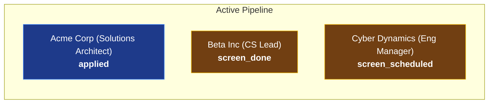

# ⚡ Job Pipeline Agent (`pipeline`)

> **An open-source, AI-assisted job search state engine, recruiter vetting system, and follow-up draft generator.**

[](https://www.python.org/downloads/)
[](https://fastapi.tiangolo.com/)
[](https://deepmind.google/technologies/gemini/)
[](https://opensource.org/licenses/MIT)

A multi-role job search generates a massive amount of fragmented state across emails, LinkedIn DMs, and calendar invites. Which applications are active? Which contacts need a nudge? Which recruiter messages are legitimate vs. impersonation scams?

**`pipeline`** manages this state deterministically using local YAML records, calculates follow-up cadence based on business-day rules (excluding US Federal Holidays), vets inbound recruiter outreach for fraud, and drafts concise follow-up messages using Gemini.

---

## 🔒 Inviolable Core Rules

1. **Never auto-sends**: The agent **only drafts** follow-up messages. You review, edit, and send every email yourself.
2. **Local & Private State**: Application state lives in local Git-committed YAML files on your machine. No proprietary cloud locking or third-party tracking.
3. **Deterministic Cadence**: Follow-up timing rules are written in code, not left to LLM hallucination.
4. **Fraud Protection**: Evaluates recruiter outreach by separating *Role Legitimacy* from *Contact Channel Safety* to safeguard against recruiter impersonation scams.

---

## ✨ Features

- 📋 **Application Pipeline Board**: Rich CLI terminal board and Web UI Kanban view tracking all job applications by stage.
- 🛡️ **Recruiter Vetting Engine**: Detects free-mail recruiter spoofing, reply-to domain mismatches, Telegram/WhatsApp shifts, and equipment check scams.
- ⏱️ **Business-Day Cadence Engine**: Calculates exact business days quiet (skipping weekends and official US Federal Holidays) to know when an application needs attention.
- ✍️ **AI Follow-Up Drafts**: Generates short (< 100 words), human-sounding follow-ups using Gemini AI.
- 📊 **Web Dashboard**: Interactive glassmorphic Kanban board, vetting simulator, and draft editor served via FastAPI (`pipeline serve`).
- 🔔 **Daily Digest & Push Notifications**: Sends daily summaries and integration support for `ntfy`.

---

## 🎨 Web Dashboard Preview

Launch the web interface locally at `http://localhost:8000`:
```bash
pipeline serve
```



---

## 🚀 Quick Start

### 1. Prerequisites
- Python 3.10+
- A Google Gemini API Key ([Get one on Google AI Studio](https://aistudio.google.com/))

### 2. Installation

Clone the repository and set up a virtual environment:
```bash
git clone https://github.com/your-username/pipeline.git
cd pipeline

python3 -m venv venv
source venv/bin/activate
pip install -e .
```

### 3. Environment Setup

Copy `.env.example` to `.env` and set your `GEMINI_API_KEY`:
```bash
cp .env.example .env
```
Edit `.env`:
```env
GEMINI_API_KEY="AIzaSyYourGeminiApiKeyHere"
```

---

## 💻 Usage & CLI Reference

### View Pipeline Status
Display the interactive terminal pipeline board:
```bash
pipeline status
```
*Output as GitHub-flavored Markdown with Mermaid diagrams:*
```bash
pipeline status --markdown
```

### Vet an Inbound Recruiter Email
Check an outreach email for impersonation scams or fraud signals:
```bash
pipeline vet --file path/to/email.txt
```
*Or interactively paste message body:*
```bash
pipeline vet
```

### Generate Follow-Up Drafts
Auto-generate concise follow-up drafts for applications requiring attention today:
```bash
pipeline draft
```
*Draft for a specific role with interactive email thread context:*
```bash
pipeline draft acme-corp-senior-solutions-architect --interactive
```

### Launch Web Dashboard
Start the local FastAPI server:
```bash
pipeline serve --port 8000
```
Open `http://localhost:8000` in your browser.

---

## 📁 Repository Structure

```text
pipeline/
├── src/pipeline/
│   ├── cadence.py      # Business-day cadence evaluation rules
│   ├── cli.py          # Typer CLI application entrypoint
│   ├── digest.py       # Daily digest & Monday summary generators
│   ├── drafting.py     # Gemini AI follow-up draft generator
│   ├── holidays.py     # US Federal Holiday & business day calculator
│   ├── models.py       # Pydantic state schemas
│   ├── server.py       # FastAPI web server
│   └── vetting.py      # Recruiter vetting & fraud detection
├── web/                # Web Dashboard frontend (HTML, CSS, JS)
├── state/applications/ # Local YAML application state records
├── examples/           # Sample state templates & env examples
├── tests/              # Pytest automated test suite
├── pyproject.toml      # Project configuration & dependencies
└── README.md           # Documentation
```

---

## 🧪 Running Tests

Run the full automated test suite:
```bash
PYTHONPATH=src pytest
```

---

## 📄 License

This project is licensed under the **MIT License**.
